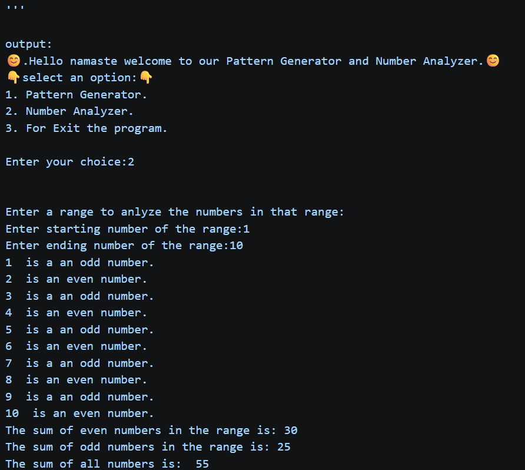
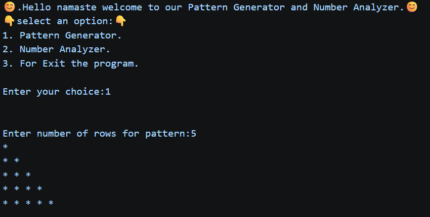
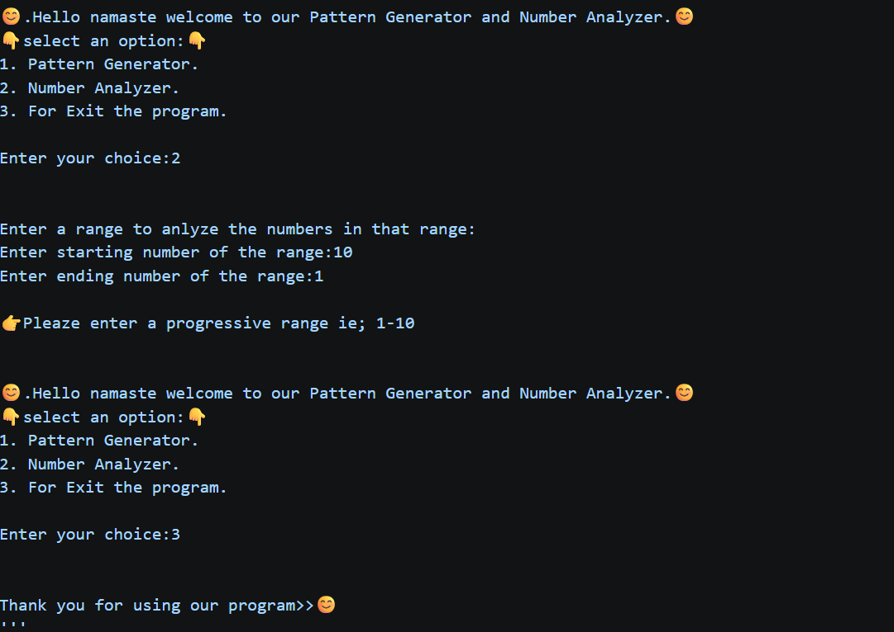

<div align="center">

# 🔢 Pattern Generator & Number Analyzer

### *A clean, interactive CLI tool built with Python — for learning loops, logic, and number theory.*

<br>


<br>

> 🎯 **Two powerful tools in one terminal app** — generate visual star patterns and perform in-depth number analysis across any range, all from an interactive menu-driven interface.

</div>

---

## 📋 Table of Contents

- [About the Project](#-about-the-project)
- [Features](#-features)
- [Tech Stack](#-tech-stack)
- [Program Workflow](#-program-workflow)
- [Folder Structure](#-folder-structure)
- [Installation & Setup](#-installation--setup)
- [Usage](#-usage)
- [Screenshots](#-screenshots)
- [Challenges Solved](#-challenges-solved)
- [Future Improvements](#-future-roadmap)
- [Contributing](#-contributing)
- [License](#-license)
- [Author](#-author)

---

## 🧠 About the Project

**Pattern Generator & Number Analyzer** is a beginner-to-intermediate Python CLI project that demonstrates core programming concepts — loops, conditionals, match-case statements, and input validation — all wrapped in a friendly, interactive menu.

It is designed for:
- 🎓 Students learning Python fundamentals
- 👨‍💻 Developers exploring Python's `match` statement (introduced in Python 3.10)
- 🧪 Anyone wanting a clean, reusable CLI boilerplate

---

## ✨ Features

### 🔷 Pattern Generator
- Generates a **left-aligned right-triangle star pattern** of any size
- Accepts user-defined number of rows
- Validates for non-negative integer input
- Gracefully handles invalid input with re-prompting

### 🔷 Number Analyzer
- Accepts a **user-defined numeric range** (start → end)
- Classifies each number as **even** or **odd**
- Computes:
  - ➕ Sum of all **even** numbers in range
  - ➕ Sum of all **odd** numbers in range
  - ➕ **Total sum** of all numbers in range
- Validates progressive range (start < end), prompts user on invalid input

### 🔷 Interactive Menu System
- Continuous loop with a clean **3-option menu**
- Uses Python 3.10+ **`match-case`** (structural pattern matching)
- Graceful **exit** with a farewell message
- Handles **invalid choices** without crashing

---

## 🛠️ Tech Stack

| Category       | Technology            |
|----------------|-----------------------|
| Language       | Python 3.10+          |
| Paradigm       | Procedural / Scripting|
| Interface      | Command Line (CLI)    |
| Python Feature | `match-case` (PEP 634)|
| Control Flow   | `while`, `for`, `if-else`, `break`, `continue` |
| I/O            | `input()`, `print()`  |
| Dependencies   | None (stdlib only)    |

> ✅ **Zero external dependencies** — runs on any machine with Python 3.10+

---

## 🔄 Program Workflow

```
┌─────────────────────────────────────────┐
│         Program Start (while loop)      │
└────────────────┬────────────────────────┘
                 │
                 ▼
       ┌─────────────────┐
       │  Display Menu   │
       └────────┬────────┘
                │
       ┌────────▼────────┐
       │  User Input     │ ──► match-case dispatcher
       └────────┬────────┘
                │
     ┌──────────┼──────────────┐
     │          │              │
     ▼          ▼              ▼
  Case 1      Case 2        Case 3
  Pattern    Number         Exit
 Generator  Analyzer       (break)
     │          │
     ▼          ▼
 Row input   Range input
 Validation  Validation
     │          │
     ▼          ▼
 Print Star  Classify &
  Pattern    Summarize
```

---

## 📁 Folder Structure

```
pattern-number-analyzer/
│
├── PR2.py          # Main program file — all logic lives here
└── README.md       # Project documentation
```

> 💡 Single-file architecture — intentionally minimal for educational clarity.

---

## ⚙️ Installation & Setup

### Prerequisites

Make sure you have **Python 3.10 or higher** installed.

```bash
python --version
# Expected: Python 3.10.x or above
```

### Clone the Repository

```bash
git clone https://github.com/your-username/pattern-number-analyzer.git
cd pattern-number-analyzer
```

### Run the Program

```bash
python PR2.py
```

That's it — no pip installs, no virtual environments, no configuration needed. 🚀

---

## 🚀 Usage

### Launching the App

```bash
python PR2.py
```

You'll see:

```
😊.Hello namaste welcome to our Pattern Generator and Number Analyzer.😊
👇select an option:👇
1. Pattern Generator.
2. Number Analyzer.
3. For Exit the program.

Enter your choice:
```

---

### Option 1 — Pattern Generator

```
Enter your choice: 1

Enter number of rows for pattern: 5
*
* *
* * *
* * * *
* * * * *
```

| Input (rows) | Output Shape         |
|:------------:|----------------------|
| `3`          | 3-row triangle       |
| `5`          | 5-row triangle       |
| `0`          | Empty (no output)    |
| `-1`         | Prompts for re-entry |

---

### Option 2 — Number Analyzer

```
Enter your choice: 2

Enter a range to analyze the numbers in that range:
Enter starting number of the range: 1
Enter ending number of the range: 10

1  is an odd number.
2  is an even number.
...
10  is an even number.

The sum of even numbers in the range is: 30
The sum of odd numbers in the range is: 25
The sum of all numbers is: 55
```

| Range  | Even Sum | Odd Sum | Total |
|--------|----------|---------|-------|
| 1–10   | 30       | 25      | 55    |
| 1–5    | 6        | 9       | 15    |
| 2–8    | 20       | 12      | 32    |

> ⚠️ If `start >= end`, the program displays an error and loops back to the menu.

---

### Option 3 — Exit

```
Enter your choice: 3

Thank you for using our program>> 😊
```

---

## 📸 Screenshots

### 🖥️ Number Analyzer — Range 1 to 10



> Classifies each number as odd/even and displays all three sums at the end of the range.

---

### 🖥️ Pattern Generator — 5 Rows



> Generates a clean left-aligned right-triangle pattern with 5 rows.

---

### 🖥️ Invalid Range Handling & Exit



> Shows graceful input validation and the farewell exit message.

---

## 🧩 Challenges Solved

| Challenge | Solution |
|-----------|----------|
| Handling invalid (negative) row input in Pattern Generator | Added `if row >= 0` guard with re-prompt |
| Preventing reverse/invalid ranges in Number Analyzer | `if end > start` check with `continue` to loop back to menu |
| Keeping the app running across multiple sessions | Outer `while True` loop with clean `break` on exit |
| Clean menu dispatch without long if-elif chains | Used Python 3.10+ `match-case` for structural clarity |
| Preventing crashes on invalid menu input | `case _` wildcard catches all unrecognized input |

---

## 🔭 Future Roadmap

- [ ] 🔺 Add more pattern types — pyramid, diamond, hollow square, number patterns
- [ ] 📊 Add prime number detection within the analyzed range
- [ ] 💾 Export analysis results to a `.txt` or `.csv` file
- [ ] 🎨 Add color output using the `colorama` library
- [ ] 🖥️ Build a simple GUI version using `tkinter`
- [ ] 🧪 Add unit tests using `pytest`
- [ ] 🔢 Support floating-point ranges with step control
- [ ] 📦 Package as a pip-installable CLI tool

---

## 🤝 Contributing

Contributions, improvements, and feature suggestions are welcome!

```bash
# 1. Fork the repository
# 2. Create your feature branch
git checkout -b feature/add-diamond-pattern

# 3. Commit your changes
git commit -m "feat: add diamond star pattern option"

# 4. Push to your branch
git push origin feature/add-diamond-pattern

# 5. Open a Pull Request
```

### Contribution Guidelines
- Keep code beginner-friendly and well-commented
- Follow the existing menu/match-case structure
- Add your feature as a new `case` in the menu
- Update this README with your new feature

---

## 📄 License

This project is licensed under the **MIT License** — feel free to use, modify, and distribute.

```
MIT License — Copyright (c) 2026
```

---

## 👤 Author

<div align="center">

**Crafted with ❤️ and Python**

[](https://github.com/your-Ved Dhameliya)

*"Code is poetry — even a triangle of stars tells a story."*

</div>

---

<div align="center">

⭐ **If this project helped you learn something new, consider giving it a star!** ⭐

</div>
