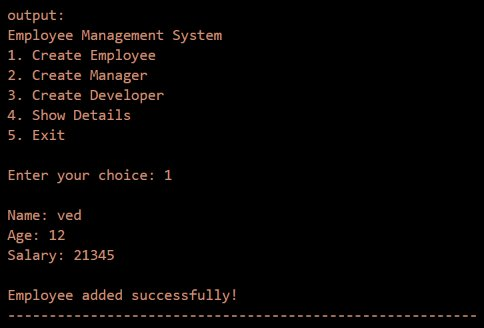
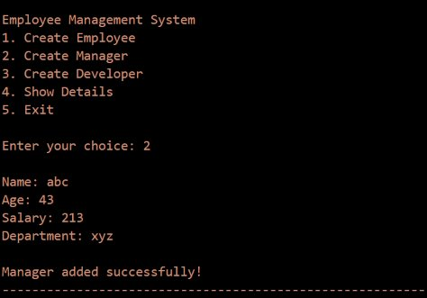
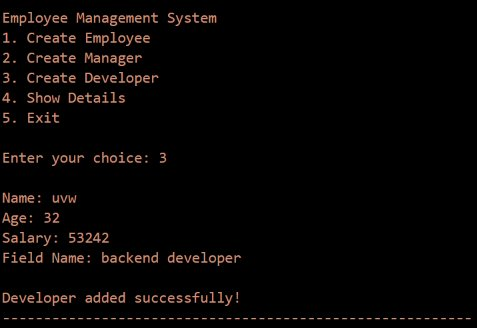
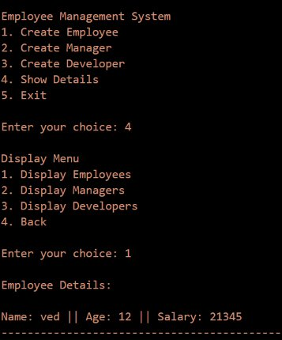
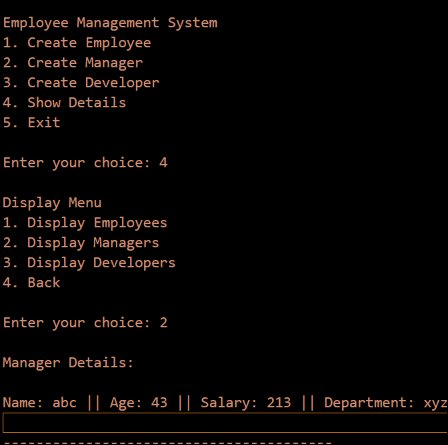
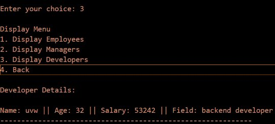
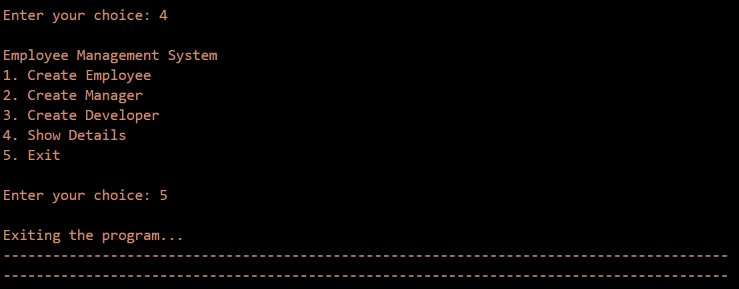

<div align="center">

# -- ! Employee Management System ! --
### *Interactive Console-Based Employee Record Management with OOP*

[](https://www.python.org/)
[](https://www.python.org/)
[](https://www.python.org/)
[](https://www.python.org/)

<br/>

> *"Object-Oriented Programming is not just a paradigm — it's the art of modeling the real world in code."*

</div>

---

## 📋 Table of Contents

- [📌 Overview](#-overview)
- [🎯 Problem Statement](#-problem-statement)
- [✨ Key Features](#-key-features)
- [🏗️ Project Structure](#️-project-structure)
- [🔄 Project Workflow](#-project-workflow)
- [🧱 Class Design & Inheritance](#-class-design--inheritance)
- [➕ Operation 1 — Create Employee](#-operation-1--create-employee)
- [👔 Operation 2 — Create Manager](#-operation-2--create-manager)
- [💻 Operation 3 — Create Developer](#-operation-3--create-developer)
- [📋 Operation 4 — Show Details](#-operation-4--show-details)
- [🚪 Operation 5 — Exit](#-operation-5--exit)
- [🛠️ Tech Stack](#️-tech-stack)
- [📈 Results & Insights](#-results--insights)
- [🏆 Advantages](#-advantages)
- [📄 License](#-license)
- [👤 Author](#-author)
- [🙏 Acknowledgements](#-acknowledgements)

---

## 📌 Overview

The **Employee Management System** is a console-based interactive Python application that demonstrates core **Object-Oriented Programming (OOP)** concepts such as **classes**, **inheritance**, **encapsulation**, **method overriding**, and **name mangling**. The program presents a menu-driven interface powered by `match-case` and runs continuously until the user chooses to exit.

This project is designed to:
- Strengthen understanding of Python OOP — classes, inheritance, and encapsulation
- Practice method overriding and access of private (name-mangled) attributes in subclasses
- Apply CRUD-style logic (Create & Read) in a real-world employee management scenario
- Use Python's `match-case` for clean, structured control flow

---

## 🎯 Problem Statement

> **Objective:** Build a console-based OOP application to manage different types of employees — create, store, and display records for Employees, Managers, and Developers using inheritance.

| 📂 Feature | 📄 Type | 🔍 Description |
|------------|---------|----------------|
| Create Employee | Data Entry | Stores name, age, and salary using a base class |
| Create Manager | Data Entry | Extends Employee with an additional department field |
| Create Developer | Data Entry | Extends Employee with an additional field (specialization) |
| Show Details | Data Retrieval | Sub-menu to display records of each type |

The goal is to demonstrate **Python OOP fundamentals** — inheritance, encapsulation (private attributes), method overriding — through a clean, interactive CRUD application.

---

## ✨ Key Features

| Feature | Description |
|--------|-------------|
| 🔁 **Infinite Menu Loop** | Program runs continuously until user selects Exit |
| 🧱 **Class Hierarchy** | `Employee` base class with `Manager` and `Developer` subclasses |
| 🔒 **Encapsulation** | Salary stored as a private attribute (`__salary`) using name mangling |
| 🔄 **Method Overriding** | `setter()` and `display()` overridden in each subclass |
| 📋 **Sub-Menu for Display** | Nested `match-case` menu to view each employee type separately |
| 📦 **List-Based Storage** | Separate lists for Employees, Managers, and Developers |
| 🖥️ **CLI Interface** | Clean text-based menu for user interaction |
| ⚠️ **Invalid Input Handling** | Detects and reports invalid choices at all menu levels |

---

## 🏗️ Project Structure

```
📦 employee-management/
│
├── 📄 project_5.py          ← Main Python script (entry point)
├── 📄 README.md             ← Project documentation
│
└── 📁 assets/               ← Output screenshots
    ├── 🖼️ output_1_add_employee.png
    ├── 🖼️ output_2_add_manager.png
    ├── 🖼️ output_3_add_developer.png
    ├── 🖼️ output_4_show_details_menu.png
    ├── 🖼️ output_5_display_manager.png
    ├── 🖼️ output_6_display_developer.png
    └── 🖼️ output_7_exit.png
```

---

## 🔄 Project Workflow

```
Program Start
      │
      ▼
┌─────────────────────────────────┐
│       Display Main Menu         │  ← Options: 1-Employee / 2-Manager
│                                 │             3-Developer / 4-Show / 5-Exit
└──────────────┬──────────────────┘
               │
   ┌───────────┼──────────────┐
   ▼           ▼              ▼
┌──────┐   ┌──────┐      ┌────────────┐
│  1   │   │  2   │      │     3      │
│ Emp  │   │ Mgr  │      │    Dev     │
└──┬───┘   └──┬───┘      └────┬───────┘
   │          │               │
   ▼          ▼               ▼
Input      Input          Input
name/age/  + dept         + field
salary
   │          │               │
   ▼          ▼               ▼
Append to  Append to      Append to
Emp_list   Mgr_list       Dev_list
               │
        ┌──────┴─────┐
        ▼            ▼
    ┌───────┐   ┌──────────┐
    │   4   │   │    5     │
    │ Show  │   │   Exit   │
    └───┬───┘   └──────────┘
        │
   Sub-menu:
   1-Employees
   2-Managers
   3-Developers
   4-Back
        │
        ▼
   Loop over list
   Call .display()
        │
   Loop Back to Menu
        │
  (Choice: 5) Exit ✅
```

---

## 🧱 Class Design & Inheritance

```
         ┌─────────────────────┐
         │      Employee       │  ← Base Class
         │---------------------|
         │ - name              │
         │ - age               │
         │ - __salary (private)│
         │---------------------|
         │ + setter()          │
         │ + display()         │
         └──────────┬──────────┘
                    │
         ┌──────────┴──────────┐
         │                     │
┌────────▼────────┐   ┌────────▼────────┐
│     Manager     │   │    Developer    │
│-----------------|   |-----------------|
│ - department    │   │ - field         │
│-----------------|   |-----------------|
│ + setter()  ◄──┐│   │ + setter()  ◄──┐│
│ + display() ◄──┘│   │ + display() ◄──┘│
└─────────────────┘   └─────────────────┘
  (calls super())        (calls super())
```

**Key OOP Concepts Used:**

| Concept | Implementation |
|---------|---------------|
| 🏛️ **Class** | `Employee`, `Manager`, `Developer` defined with `class` keyword |
| 👶 **Inheritance** | `Manager(Employee)`, `Developer(Employee)` |
| 🔒 **Encapsulation** | `__salary` is private via Python name mangling |
| 🔄 **Method Overriding** | `setter()` and `display()` redefined in subclasses |
| 🔗 **super()** | Subclass `setter()` calls `super().setter()` to reuse parent logic |
| 🔑 **Name Mangling** | `_Employee__salary` used in subclasses to access private attribute |

---

## ➕ Operation 1 — Create Employee

### 📝 What it does

Creates an instance of the `Employee` class, collects basic details via `input()`, and appends it to `Employee_list`.

**Fields Collected:**

| Field | Type | Example |
|-------|------|---------|
| `name` | str | ved |
| `age` | int | 12 |
| `__salary` | int | 21345 |

**Logic:**
```python
class Employee:
    def __init__(self):
        self.name = None
        self.age = None
        self.__salary = None

    def setter(self):
        self.name = input("\nName: ")
        self.age = int(input("Age: "))
        self.__salary = int(input("Salary: "))

    def display(self):
        print(f"\nName: {self.name} || Age: {self.age} || Salary: {self.__salary}")
```

**Output:**



---

## 👔 Operation 2 — Create Manager

### 📝 What it does

Creates an instance of `Manager` (which inherits from `Employee`), collects all employee fields plus a `department`, and appends to `Manager_list`.

**Fields Collected:**

| Field | Type | Example |
|-------|------|---------|
| `name` | str | abc |
| `age` | int | 43 |
| `__salary` | int | 213 |
| `department` | str | xyz |

**Logic:**
```python
class Manager(Employee):
    def __init__(self):
        super().__init__()
        self.department = None

    def setter(self):
        super().setter()
        self.department = input("Department: ")

    def display(self):
        print(f"\nName: {self.name} || Age: {self.age} || "
              f"Salary: {self._Employee__salary} || Department: {self.department}")
```

**Output:**



---

## 💻 Operation 3 — Create Developer

### 📝 What it does

Creates an instance of `Developer` (which inherits from `Employee`), collects all employee fields plus a `field` (specialization), and appends to `Developer_list`.

**Fields Collected:**

| Field | Type | Example |
|-------|------|---------|
| `name` | str | uvw |
| `age` | int | 32 |
| `__salary` | int | 53242 |
| `field` | str | backend developer |

**Logic:**
```python
class Developer(Employee):
    def __init__(self):
        super().__init__()
        self.field = None

    def setter(self):
        super().setter()
        self.field = input("Field Name: ")

    def display(self):
        print(f"\nName: {self.name} || Age: {self.age} || "
              f"Salary: {self._Employee__salary} || Field: {self.field}")
```

**Output:**



---

## 📋 Operation 4 — Show Details

### 👁️ What it does

Opens a nested sub-menu with its own `match-case` block, allowing the user to view records for any employee type. Iterates through the corresponding list and calls `.display()` on each object.

**Sub-Menu Options:**

| Choice | Action |
|--------|--------|
| 1 | Display all Employees |
| 2 | Display all Managers |
| 3 | Display all Developers |
| 4 | Back to main menu |

**Logic:**
```python
case "4":
    while True:
        display_choice = input("\nEnter your choice: ")
        match display_choice:
            case "1":
                for emp in Employee_list:
                    emp.display()
            case "2":
                for man in Manager_list:
                    man.display()
            case "3":
                for dev in Developer_list:
                    dev.display()
            case "4":
                break
```

**Output — Show Details Menu & Display Employee:**



**Output — Display Manager:**



**Output — Display Developer:**



---

## 🚪 Operation 5 — Exit

### 🛑 What it does

Breaks out of the infinite `while True` loop, printing a farewell message and terminating the program cleanly.

**Logic:**
```python
case "5":
    print("\nExiting the program...")
    break
```

**Output:**



---

## 🛠️ Tech Stack

| Tool | Version | Purpose |
|------|---------|---------|
| 🐍 **Python** | 3.10+ | Core programming language |
| 🏛️ **Classes** | Built-in OOP | Defines `Employee`, `Manager`, `Developer` |
| 👶 **Inheritance** | Built-in OOP | `Manager` and `Developer` extend `Employee` |
| 🔒 **Encapsulation** | Built-in OOP | Private `__salary` attribute with name mangling |
| 🔁 **While Loop** | Built-in | Infinite menu loop control |
| 📋 **List** | Built-in | Separate lists store each employee type |
| 🔀 **Match-Case** | Python 3.10+ | Structural pattern matching for menu control |
| 🖨️ **print() / input()** | Built-in | Console I/O and user interaction |

---

## 📈 Results & Insights

After running the program, the following operations are demonstrated:

- ✅ **Employee Created** — Basic record (name, age, salary) stored via `Employee` class
- 👔 **Manager Created** — Extended record with department stored via `Manager` class
- 💻 **Developer Created** — Extended record with field/specialization stored via `Developer` class
- 👁️ **Records Displayed** — Each type viewed through the nested display sub-menu
- 🚪 **Clean Exit** — Program terminates gracefully
- ⚠️ **Error Feedback** — Invalid choices trigger a clear "Invalid choice!" message at both menu levels

---

## 🏆 Advantages

| Advantage | Detail |
|-----------|--------|
| 🎓 **Beginner Friendly** | Demonstrates core OOP: classes, inheritance, encapsulation in one project |
| 🧱 **OOP Modeling** | Mirrors real-world employee hierarchies using class-based design |
| 🔒 **Data Safety** | Private `__salary` attribute demonstrates encapsulation best practices |
| 🔄 **Reusable Code** | `super()` avoids repetition; base class logic reused across subclasses |
| 🖥️ **No Dependencies** | Runs with pure Python — no external libraries needed |
| ⚡ **Lightweight** | Single-file script, instantly runnable from any terminal |
| 🧪 **Extensible** | Easy to add roles (e.g., `Intern`, `HR`) or features like update/delete |
| 📖 **Readable Code** | Clean `match-case` structure and OOP separation makes logic easy to follow |

---

## 📄 License

This project is licensed under the **MIT License** — see the [LICENSE](LICENSE) file for full details.

```
MIT License — Free to use, modify, and distribute with attribution.
```

---

## 👤 Author

<div align="center">

### Ved Dhameliya

[](https://github.com/ved-dhameliya)
[](https://www.linkedin.com/in/ved-dhameliya/)

> *"Every class starts with a single `__init__` — just like every journey starts with a single step."*

**🎓 Role:** Junior Python Developer | OOP Enthusiast \
**📍 Location:** India \
**🛠️ Skills:** Python · OOP · Inheritance · CLI Applications · CRUD Logic

</div>

---

## 🙏 Acknowledgements

Special thanks to the following resources and communities that made this project possible:

- 📚 [Python Official Docs](https://docs.python.org/3/) — Official Python language reference
- 🏛️ [Real Python — OOP](https://realpython.com/python3-object-oriented-programming/) — In-depth OOP tutorials
- 🔒 [Real Python — Encapsulation](https://realpython.com/python-classes/#access-modifiers-public-protected-and-private-attributes) — Name mangling and private attributes
- 🔀 [PEP 634 — Match-Case](https://peps.python.org/pep-0634/) — Structural Pattern Matching specification
- 🖥️ [W3Schools Python](https://www.w3schools.com/python/) — Beginner Python reference
- 💬 [Stack Overflow Community](https://stackoverflow.com/) — Problem-solving support
- 📖 [GeeksForGeeks — Python OOP](https://www.geeksforgeeks.org/python-oops-concepts/) — Python OOP concepts guide

---

<div align="center">

---

*Made with ❤️ and ☕ — Last updated: 15 June, 2026*

</div>
