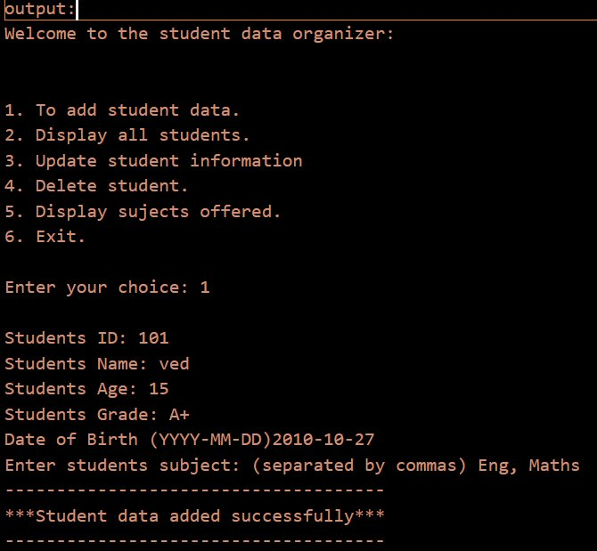
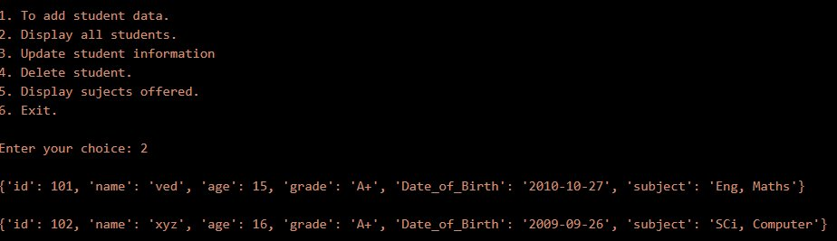
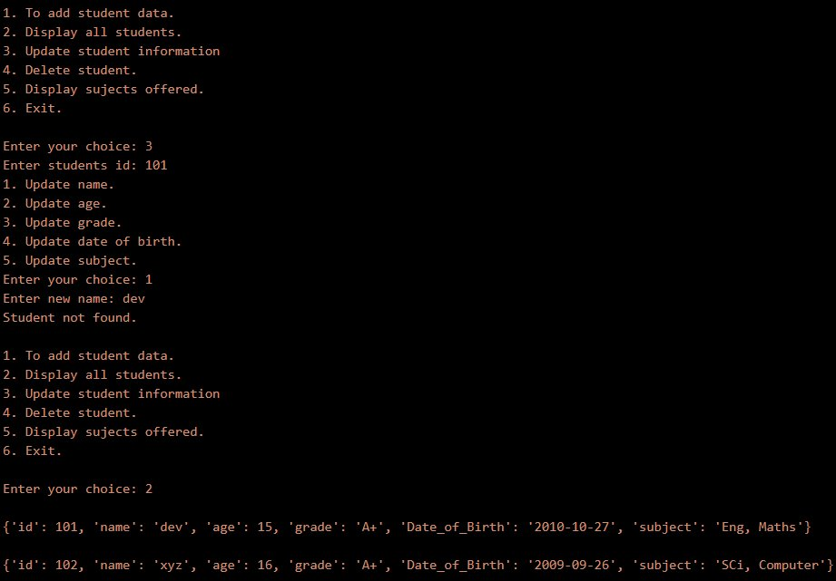
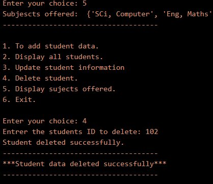
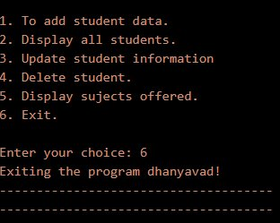

<div align="center">

# -- ! Student Data Organizer ! --
### *Interactive Console-Based Student Record Management System*

[](https://www.python.org/)
[](https://www.python.org/)
[](https://www.python.org/)
[](https://www.python.org/)

<br/>

> *"Data management is not just about storing information — it's about organizing it with purpose."*

</div>

---

## 📋 Table of Contents

- [📌 Overview](#-overview)
- [🎯 Problem Statement](#-problem-statement)
- [✨ Key Features](#-key-features)
- [🏗️ Project Structure](#️-project-structure)
- [🔄 Project Workflow](#-project-workflow)
- [➕ Operation 1 — Add Student](#-operation-1--add-student)
- [📋 Operation 2 — Display All Students](#-operation-2--display-all-students)
- [✏️ Operation 3 — Update Student](#️-operation-3--update-student)
- [🗑️ Operation 4 — Delete Student](#️-operation-4--delete-student)
- [📚 Operation 5 — Display Subjects Offered](#-operation-5--display-subjects-offered)
- [🚪 Operation 6 — Exit](#-operation-6--exit)
- [🛠️ Tech Stack](#️-tech-stack)
- [📈 Results & Insights](#-results--insights)
- [🏆 Advantages](#-advantages)
- [📄 License](#-license)
- [👤 Author](#-author)
- [🙏 Acknowledgements](#-acknowledgements)

---

## 📌 Overview

The **Student Data Organizer** is a beginner-friendly, interactive Python console application that demonstrates core programming concepts such as **dictionaries**, **lists**, **match-case statements**, **while loops**, and **user input handling**. The program presents a menu-driven interface that runs continuously until the user chooses to exit.

This project is designed to:
- Strengthen understanding of Python dictionaries and list operations
- Practice user input validation and menu-driven program design
- Apply CRUD (Create, Read, Update, Delete) logic in a real-world scenario
- Use Python's `match-case` (structural pattern matching) for clean control flow

---

## 🎯 Problem Statement

> **Objective:** Build a console-based interactive tool to manage student records — add, display, update, delete, and analyze student data.

You are building a simple data management utility for students learning Python. The program must accept user choices from a menu and execute the corresponding task — storing student information in a list of dictionaries and performing operations on it.

| 📂 Feature | 📄 Type | 🔍 Description |
|------------|---------|----------------|
| Add Student | Data Entry | Collects and stores student details into a dictionary |
| Display Students | Data Retrieval | Prints all stored student records |
| Update Student | Data Modification | Finds a student by ID and modifies a specific field |
| Delete Student | Data Removal | Removes a student record by ID from the list |
| Display Subjects | Data Analysis | Extracts and displays unique subjects using a set |

The goal is to demonstrate **fundamental Python programming skills** through a clean, menu-driven interactive CRUD application.

---

## ✨ Key Features

| Feature | Description |
|--------|-------------|
| 🔁 **Infinite Menu Loop** | Program runs continuously until user selects Exit |
| 📝 **Add Student** | Stores ID, Name, Age, Grade, DOB, and Subjects in a dictionary |
| 👁️ **Display All Students** | Iterates and prints all student records in the list |
| ✏️ **Update Student** | Nested match-case to update any individual field by student ID |
| 🗑️ **Delete Student** | Removes student record from list by matching ID |
| 📚 **Unique Subjects** | Uses a `set` to collect and display all subjects offered |
| 🖥️ **CLI Interface** | Simple, clean text-based menu for user interaction |
| ⚠️ **Invalid Input Handling** | Detects and reports invalid menu or update choices |

---

## 🏗️ Project Structure

```
📦 student-data-organizer/
│
├── 📄 project_3.py          ← Main Python script (entry point)
├── 📄 README.md             ← Project documentation
│
└── 📁 assets/               ← Output screenshots
    ├── 🖼️ output_1_add_student.png
    ├── 🖼️ output_2_display_all.png
    ├── 🖼️ output_3_update_student.png
    ├── 🖼️ output_4_subjects_delete.png
    ├── 🖼️ output_5_display_after_delete.png
    └── 🖼️ output_6_exit.png
```

---

## 🔄 Project Workflow

```
Program Start
      │
      ▼
┌─────────────────────────────────┐
│       Display Main Menu         │  ← Options: 1-Add / 2-Display / 3-Update
│                                 │             4-Delete / 5-Subjects / 6-Exit
└──────────────┬──────────────────┘
               │
   ┌───────────┼──────────────┐
   ▼           ▼              ▼
┌──────┐   ┌──────┐      ┌────────┐
│  1   │   │  2   │      │   3    │
│ Add  │   │ Show │      │ Update │
└──┬───┘   └──┬───┘      └───┬────┘
   │          │              │
   ▼          ▼              ▼
Input      Print all    Input ID →
fields     students     Sub-menu
   │                    1-5 fields
   ▼                         │
Append to               Update dict
list                         │
   │          ┌──────────────┘
   │      ┌───┴───┐
   │      ▼       ▼
   │   ┌──────┐ ┌──────────┐
   │   │  4   │ │    5     │
   │   │Delete│ │Subjects  │
   │   └──┬───┘ └────┬─────┘
   │      │          │
   │   Remove     Collect set
   │   by ID      & print
   │
   ▼
┌─────────────────────────────┐
│   Output to Console         │
└────────────┬────────────────┘
             │
     Loop Back to Menu
             │
      (Choice: 6) Exit ✅
```

---

## ➕ Operation 1 — Add Student

### 📝 What it does

Collects student details from the user via `input()` and stores them in a **dictionary**, which is then appended to the master `list_of_all_students` list.

**Fields Collected:**

| Field | Type | Example |
|-------|------|---------|
| `id` | int | 101 |
| `name` | str | ved |
| `age` | int | 15 |
| `grade` | str (uppercase) | A+ |
| `Date_of_Birth` | str | 2010-10-27 |
| `subject` | str (comma-separated) | Eng, Maths |

**Logic:**
```python
id = int(input("Students ID: "))
name = input("Students Name: ")
age = int(input("Students Age: "))
grade = input("Students Grade: ").upper()
Date_of_Birth = input("Date of Birth (YYYY-MM-DD): ")
subject = input("Enter students subject: (separated by commas) ")

student = {
    "id": id, "name": name, "age": age,
    "grade": grade, "Date_of_Birth": Date_of_Birth, "subject": subject
}
list_of_all_students.append(student)
```

**Output:**



---

## 📋 Operation 2 — Display All Students

### 👁️ What it does

Iterates through `list_of_all_students` and prints every stored dictionary record to the console.

**Logic:**
```python
for student in list_of_all_students:
    print(student)
```

**Sample Output (2 students stored):**
```
{'id': 101, 'name': 'ved', 'age': 15, 'grade': 'A+', 'Date_of_Birth': '2010-10-27', 'subject': 'Eng, Maths'}
{'id': 102, 'name': 'xyz', 'age': 16, 'grade': 'A+', 'Date_of_Birth': '2009-09-26', 'subject': 'SCi, Computer'}
```

**Output:**



---

## ✏️ Operation 3 — Update Student

### 🔄 What it does

Searches for a student by their `id` and presents a sub-menu to update any one of their five fields. Uses **nested `match-case`** for clean branching.

**Logic:**
```python
entered_id = int(input("Enter students id: "))
for student in list_of_all_students:
    if student["id"] == entered_id:
        # Sub-menu: 1-Name / 2-Age / 3-Grade / 4-DOB / 5-Subject
        match update_choice:
            case 1:
                student["name"] = input("Enter new name: ")
            case 2:
                student["age"] = int(input("Enter new age: "))
            case 3:
                student["grade"] = input("Enter new grade: ").upper()
            case 4:
                student["Date_of_Birth"] = input("Enter new date of birth: ")
            case 5:
                student["subject"] = input("Enter new subject: ")
```

**Output:**



---

## 🗑️ Operation 4 — Delete Student

### ❌ What it does

Accepts a student ID from the user, finds the matching dictionary in the list, and removes it using `list.remove()`.

**Logic:**
```python
delete_id = int(input("Enter the students ID to delete: "))
for student in list_of_all_students:
    if student["id"] == delete_id:
        list_of_all_students.remove(student)
        print("Student deleted successfully.")
    else:
        print("Student not found.")
```

**Output:**



---

## 📚 Operation 5 — Display Subjects Offered

### 📖 What it does

Loops through all students, collects their subjects into a **set** (ensuring uniqueness), and prints all unique subjects offered across enrolled students.

**Logic:**
```python
subjects_offered = set()
for student in list_of_all_students:
    subject = student["subject"]
    subjects_offered.add(subject)
print("Subjects offered: ", subjects_offered)
```

**Key Concepts Used:**

| Concept | Detail |
|---------|--------|
| 🔁 `for` loop | Iterates over all student records |
| 🧮 `set` | Automatically removes duplicate subjects |
| `.add()` method | Adds each student's subject string to the set |
| 🖨️ `print()` | Displays the final unique subject collection |

**Sample Output:**
```
Subjects offered: {'SCi, Computer', 'Eng, Maths'}
```

---

## 🚪 Operation 6 — Exit

### 🛑 What it does

Breaks out of the infinite `while True` loop, printing a farewell message and terminating the program cleanly.

**Logic:**
```python
case 6:
    print("Exiting the program dhanyavad!")
    break
```

**Output:**



---

## 🛠️ Tech Stack

| Tool | Version | Purpose |
|------|---------|---------|
| 🐍 **Python** | 3.10+ | Core programming language |
| 🔁 **While Loop** | Built-in | Infinite menu loop control |
| 📦 **Dictionary** | Built-in | Stores individual student records |
| 📋 **List** | Built-in | Holds all student dictionaries |
| 🔀 **Match-Case** | Python 3.10+ | Structural pattern matching for menu control |
| 🧮 **Set** | Built-in | Unique subject collection |
| 🖨️ **print() / input()** | Built-in | Console I/O and user interaction |

---

## 📈 Results & Insights

After running the program, the following operations are demonstrated:

- ✅ **Student Added** — Full record stored as a dictionary in a list
- 👁️ **All Records Displayed** — Every student printed in dictionary format
- ✏️ **Record Updated** — Specific field modified using ID lookup and nested match-case
- 🗑️ **Student Deleted** — Record removed from list by ID; remaining records preserved
- 📚 **Subjects Listed** — Unique subjects extracted using a set collection
- 🚪 **Clean Exit** — Program terminates gracefully with a farewell message
- ⚠️ **Error Feedback** — Invalid choices trigger a clear "Invalid Choice!" message

---

## 🏆 Advantages

| Advantage | Detail |
|-----------|--------|
| 🎓 **Beginner Friendly** | Core concepts: dicts, lists, loops, and match-case in one project |
| 📚 **CRUD Operations** | Covers all four fundamental data operations in a single program |
| 🔄 **Real-World Logic** | Mirrors actual student record management systems |
| 🧩 **Structured Data** | Dictionary-based storage models real database records |
| 🖥️ **No Dependencies** | Runs with pure Python — no external libraries needed |
| ⚡ **Lightweight** | Single-file script, instantly runnable from any terminal |
| 🧪 **Extensible** | Easy to add features like search, sorting, or file persistence |
| 📖 **Readable Code** | Clear `match-case` structure makes logic easy to follow |

---

## 📄 License

This project is licensed under the **MIT License** — see the [LICENSE](LICENSE) file for full details.

```
MIT License — Free to use, modify, and distribute with attribution.
```

---

## 👤 Author

<div align="center">

### Ved Dhameliya


> *"Every student record starts with a single input — just like every program starts with a single line."*

**🎓 Role:** Junior Python Developer | Programming Enthusiast \
**📍 Location:** India \
**🛠️ Skills:** Python · Dictionaries · CLI Applications · CRUD Logic · Data Management

</div>

---

## 🙏 Acknowledgements

Special thanks to the following resources and communities that made this project possible:

- 📚 [Python Official Docs](https://docs.python.org/3/) — Official Python language reference
- 🔁 [Real Python — Dictionaries](https://realpython.com/python-dicts/) — In-depth dictionary tutorials
- 🔀 [PEP 634 — Match-Case](https://peps.python.org/pep-0634/) — Structural Pattern Matching specification
- 🖥️ [W3Schools Python](https://www.w3schools.com/python/) — Beginner Python reference
- 🧮 [GeeksForGeeks — Sets](https://www.geeksforgeeks.org/python-sets/) — Python set operations guide
- 💬 [Stack Overflow Community](https://stackoverflow.com/) — Problem-solving support
- 📖 [Kaggle Learn](https://www.kaggle.com/learn) — Python and programming courses

---

<div align="center">

---

*Made with ❤️ and ☕ — Last updated: 03 June, 2026*

</div>
