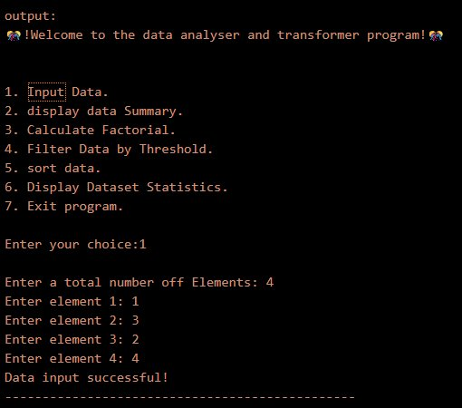
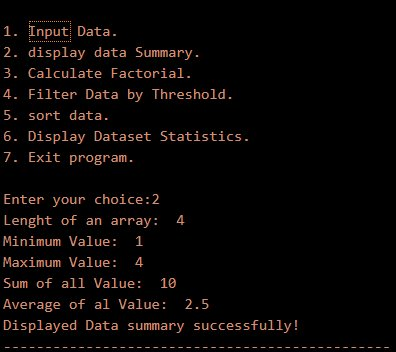
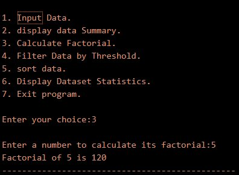
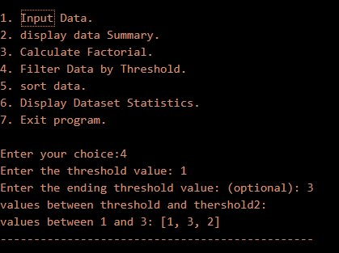
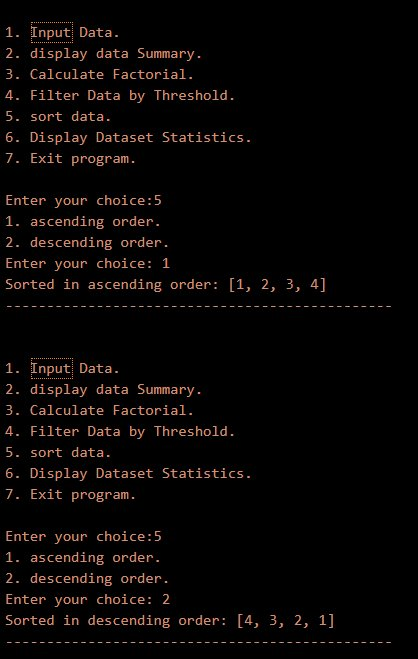
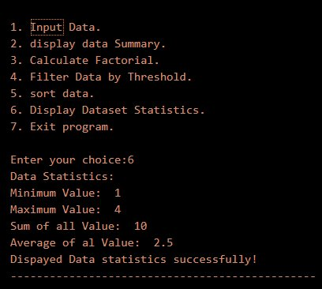
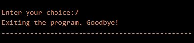

<div align="center">

# -- ! Data Analyser & Transformer ! --
### *Interactive Console-Based Data Analysis and Transformation Program*

[](https://www.python.org/)
[](https://www.python.org/)
[](https://www.python.org/)
[](https://www.python.org/)

<br/>

> *"Data analysis is not just about numbers — it's about finding meaning within them."*

</div>

---

## 📋 Table of Contents

- [📌 Overview](#-overview)
- [🎯 Problem Statement](#-problem-statement)
- [✨ Key Features](#-key-features)
- [🏗️ Project Structure](#️-project-structure)
- [🔄 Project Workflow](#-project-workflow)
- [➕ Operation 1 — Input Data](#-operation-1--input-data)
- [📋 Operation 2 — Display Data Summary](#-operation-2--display-data-summary)
- [🔢 Operation 3 — Calculate Factorial](#-operation-3--calculate-factorial)
- [🔍 Operation 4 — Filter Data by Threshold](#-operation-4--filter-data-by-threshold)
- [🔃 Operation 5 — Sort Data](#-operation-5--sort-data)
- [📊 Operation 6 — Display Dataset Statistics](#-operation-6--display-dataset-statistics)
- [🚪 Operation 7 — Exit](#-operation-7--exit)
- [🛠️ Tech Stack](#️-tech-stack)
- [📈 Results & Insights](#-results--insights)
- [🏆 Advantages](#-advantages)
- [📄 License](#-license)
- [👤 Author](#-author)
- [🙏 Acknowledgements](#-acknowledgements)

---

## 📌 Overview

The **Data Analyser & Transformer** is a beginner-friendly, interactive Python console application that demonstrates core programming concepts such as **functions**, **lists**, **match-case statements**, **while loops**, **recursion**, and **user input handling**. The program presents a menu-driven interface that runs continuously until the user chooses to exit.

This project is designed to:
- Strengthen understanding of Python functions and list operations
- Practice user input validation and menu-driven program design
- Apply data analysis logic (min, max, sum, avg, factorial, filter, sort) in a real-world scenario
- Use Python's `match-case` (structural pattern matching) for clean control flow

---

## 🎯 Problem Statement

> **Objective:** Build a console-based interactive tool to analyse and transform a dataset — input, summarize, filter, sort, and compute statistics on numerical data.

You are building a simple data analysis utility. The program must accept user choices from a menu and execute the corresponding task — storing numbers in a list and performing operations on it.

| 📂 Feature | 📄 Type | 🔍 Description |
|------------|---------|----------------|
| Input Data | Data Entry | Collects and stores integers into a list |
| Display Summary | Data Retrieval | Prints length, min, max, sum, and average |
| Calculate Factorial | Computation | Recursively computes factorial of a given number |
| Filter by Threshold | Data Filtering | Extracts values within a user-defined range |
| Sort Data | Data Transformation | Sorts list in ascending or descending order |
| Display Statistics | Data Analysis | Shows full statistical summary of the dataset |

The goal is to demonstrate **fundamental Python programming skills** through a clean, menu-driven interactive data analysis application.

---

## ✨ Key Features

| Feature | Description |
|--------|-------------|
| 🔁 **Infinite Menu Loop** | Program runs continuously until user selects Exit |
| 📝 **Input Data** | Collects N integers from the user into a list |
| 👁️ **Display Summary** | Shows length, min, max, sum, and average of the dataset |
| 🔢 **Factorial** | Recursively calculates factorial using `n * factorial(n-1)` |
| 🔍 **Filter by Threshold** | Extracts values between a start and end threshold |
| 🔃 **Sort Data** | Sub-menu to sort ascending or descending using nested match-case |
| 📊 **Dataset Statistics** | Full statistical breakdown of stored data |
| 🚪 **Clean Exit** | Breaks loop with a farewell message |
| ⚠️ **Invalid Input Handling** | Detects and reports invalid menu or sub-menu choices |

---

## 🏗️ Project Structure

```
📦 data-analyser-transformer/
│
├── 📄 PR-4.py               ← Main Python script (entry point)
├── 📄 README.md             ← Project documentation
│
└── 📁 assets/               ← Output screenshots
    ├── 🖼️ output_1_input_data.png
    ├── 🖼️ output_2_display_summary.png
    ├── 🖼️ output_3_factorial.png
    ├── 🖼️ output_4_filter_threshold.png
    ├── 🖼️ output_5_sort_data.png
    ├── 🖼️ output_6_statistics.png
    └── 🖼️ output_7_exit.png
```

---

## 🔄 Project Workflow

```
Program Start
      │
      ▼
┌─────────────────────────────────────┐
│          Display Main Menu          │  ← Options: 1-Input / 2-Summary / 3-Factorial
│                                     │             4-Filter / 5-Sort / 6-Stats / 7-Exit
└──────────────┬──────────────────────┘
               │
   ┌───────────┼──────────────────┐
   ▼           ▼                  ▼
┌──────┐   ┌──────┐          ┌────────┐
│  1   │   │  2   │          │   3    │
│Input │   │ Sum- │          │Factor- │
│ Data │   │ mary │          │  ial   │
└──┬───┘   └──┬───┘          └───┬────┘
   │          │                  │
   ▼          ▼                  ▼
Collect    Print             Recursive
N ints     stats             n * f(n-1)
   │
   ├──────────────────┐
   ▼                  ▼
┌──────┐          ┌────────┐
│  4   │          │   5    │
│Filter│          │  Sort  │
└──┬───┘          └───┬────┘
   │                  │
   ▼                  ▼
Range             Sub-menu:
filter            Asc / Desc
[t1, t2]
   │
   ▼
┌─────────────────────────────┐
│      Output to Console      │
└────────────┬────────────────┘
             │
     Loop Back to Menu
             │
      (Choice: 7) Exit ✅
```

---

## ➕ Operation 1 — Input Data

### 📝 What it does

Prompts the user for a count of elements, then collects that many integers via `input()` and appends them into the global `data` list.

**Logic:**
```python
num_elements = int(input("\nEnter a total number of Elements: "))
for i in range(num_elements):
    element = int(input(f"Enter element {i+1}: "))
    data.append(element)
print("Data input successful!")
```

**Output:**



---

## 📋 Operation 2 — Display Data Summary

### 👁️ What it does

Calls the helper functions — `length()`, `minimum()`, `maximum()`, `summ()`, and `avg()` — and prints a quick summary of the stored dataset.

**Helper Functions:**
```python
def maximum(): return max(data)
def minimum(): return min(data)
def summ():    return sum(data)
def length():  return len(data)
def avg():     return sum(data) / len(data)
```

**Sample Output:**
```
Length of an array:  4
Minimum Value:  1
Maximum Value:  4
Sum of all Value:  10
Average of all Value:  2.5
Displayed Data summary successfully!
```

**Output:**



---

## 🔢 Operation 3 — Calculate Factorial

### 🔄 What it does

Accepts a non-negative integer from the user and recursively computes its factorial using the `factorial(n)` function.

**Logic:**
```python
def factorial(n):
    if n == 0:
        return 1
    else:
        return n * factorial(n - 1)

number = int(input("\nEnter a number to calculate its factorial:"))
print("Factorial of", number, "is", factorial(number))
```

**Sample Output:**
```
Enter a number to calculate its factorial: 5
Factorial of 5 is 120
```

**Output:**



---

## 🔍 Operation 4 — Filter Data by Threshold

### ❌ What it does

Accepts a start and end threshold from the user, then iterates through `data` to extract all values falling within that inclusive range.

**Logic:**
```python
threshold = int(input("Enter the threshold value: "))
threshold2 = int(input("Enter the ending threshold value (optional): "))
f = []
for i in data:
    if threshold <= i <= threshold2:
        f.append(i)
print(f"Values between {threshold} and {threshold2}: {f}")
```

**Sample Output:**
```
Enter the threshold value: 1
Enter the ending threshold value: 3
Values between 1 and 3: [1, 3, 2]
```

**Output:**



---

## 🔃 Operation 5 — Sort Data

### 📖 What it does

Presents a sub-menu for sorting the dataset. Uses **nested `match-case`** to choose between ascending and descending order.

**Logic:**
```python
print("1. ascending order.")
print("2. descending order.")
sort_choice = int(input("Enter your choice: "))
match sort_choice:
    case 1:
        ascending_order()
    case 2:
        descending_order()
    case _:
        print("\nInvalid choice. Please try again.")
```

**Helper Functions:**
```python
def ascending_order():
    data.sort()
    print(f"Sorted in ascending order: {sorted(data)}")

def descending_order():
    data.sort(reverse=True)
    print(f"Sorted in descending order: {sorted(data, reverse=True)}")
```

**Sample Output:**
```
Sorted in ascending order:  [1, 2, 3, 4]
Sorted in descending order: [4, 3, 2, 1]
```

**Output:**



---

## 📊 Operation 6 — Display Dataset Statistics

### 📈 What it does

Displays a full statistical breakdown of the current dataset — minimum, maximum, sum, and average — using the same helper functions as the summary operation.

**Logic:**
```python
print("Data Statistics: ")
print(f"Minimum Value: ", minimum())
print(f"Maximum Value: ", maximum())
print(f"Sum of all Value: ", summ())
print(f"Average of all Value: ", avg())
print("Displayed Data statistics successfully!")
```

**Sample Output:**
```
Data Statistics:
Minimum Value:  1
Maximum Value:  4
Sum of all Value:  10
Average of all Value:  2.5
Displayed Data statistics successfully!
```

**Output:**



---

## 🚪 Operation 7 — Exit

### 🛑 What it does

Breaks out of the infinite `while True` loop, printing a farewell message and terminating the program cleanly.

**Logic:**
```python
case 7:
    print("Exiting the program. Goodbye!")
    break
```

**Output:**



---

## 🛠️ Tech Stack

| Tool | Version | Purpose |
|------|---------|---------|
| 🐍 **Python** | 3.10+ | Core programming language |
| 🔁 **While Loop** | Built-in | Infinite menu loop control |
| 📋 **List** | Built-in | Stores all input integers |
| 🔀 **Match-Case** | Python 3.10+ | Structural pattern matching for menu and sub-menu |
| 🔢 **Recursion** | Built-in | Factorial computation via `factorial(n-1)` |
| 📊 **Built-in Functions** | `min`, `max`, `sum`, `len` | Core data statistics |
| 🖨️ **print() / input()** | Built-in | Console I/O and user interaction |

---

## 📈 Results & Insights

After running the program, the following operations are demonstrated:

- ✅ **Data Inputted** — N integers collected and stored in a list
- 👁️ **Summary Displayed** — Length, min, max, sum, and average printed
- 🔢 **Factorial Computed** — Recursive calculation for any non-negative integer
- 🔍 **Data Filtered** — Values within a threshold range extracted into a new list
- 🔃 **Data Sorted** — Ascending and descending sort applied via nested match-case
- 📊 **Statistics Shown** — Full statistical breakdown of the dataset
- 🚪 **Clean Exit** — Program terminates gracefully with a farewell message
- ⚠️ **Error Feedback** — Invalid choices trigger a clear "Invalid Choice!" message

---

## 🏆 Advantages

| Advantage | Detail |
|-----------|--------|
| 🎓 **Beginner Friendly** | Core concepts: lists, functions, recursion, loops, match-case in one project |
| 📚 **Multiple Operations** | Covers input, summary, factorial, filter, sort, and statistics |
| 🔄 **Real-World Logic** | Mirrors actual data analysis workflows |
| 🧩 **Modular Design** | Each operation is a separate function for clean, readable code |
| 🖥️ **No Dependencies** | Runs with pure Python — no external libraries needed |
| ⚡ **Lightweight** | Single-file script, instantly runnable from any terminal |
| 🧪 **Extensible** | Easy to add features like file I/O, plotting, or more stats |
| 📖 **Readable Code** | Clear `match-case` structure makes logic easy to follow |

---

## 📄 License

This project is licensed under the **MIT License** — see the [LICENSE](LICENSE) file for full details.

```
MIT License — Free to use, modify, and distribute with attribution.
```

---

## 👤 Author

<div align="center">

### Ved Dhameliya

[](https://github.com/VedDhameliya)
[](https://www.linkedin.com/in/ved-dhameliya/)

> *"Every dataset tells a story — you just have to know the right questions to ask."*

**🎓 Role:** Junior Python Developer | Programming Enthusiast  
**📍 Location:** India  
**🛠️ Skills:** Python · Lists · Functions · Recursion · CLI Applications · Data Analysis

</div>

---

## 🙏 Acknowledgements

Special thanks to the following resources and communities that made this project possible:

- 📚 [Python Official Docs](https://docs.python.org/3/) — Official Python language reference
- 🔁 [Real Python — Lists](https://realpython.com/python-lists-tuples/) — In-depth list and tuple tutorials
- 🔀 [PEP 634 — Match-Case](https://peps.python.org/pep-0634/) — Structural Pattern Matching specification
- 🖥️ [W3Schools Python](https://www.w3schools.com/python/) — Beginner Python reference
- 🔢 [GeeksForGeeks — Recursion](https://www.geeksforgeeks.org/recursion/) — Python recursion guide
- 💬 [Stack Overflow Community](https://stackoverflow.com/) — Problem-solving support
- 📖 [Kaggle Learn](https://www.kaggle.com/learn) — Python and programming courses

---

<div align="center">

---

*Made with ❤️ and ☕ — Last updated: 08 June, 2026*

</div>
